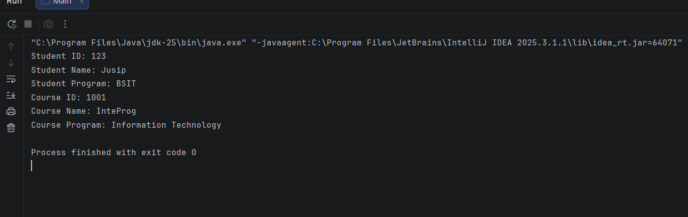

# Enrollment System
---
**Author:** Joseph Aaron De Silva

**1. Description**
- Simple enrollment system using OOP.
- Employs objects, constructors, getters, setters, access modifiers, OOP, etc.

!(Screenshot)[]
 

# Inheritance
---

